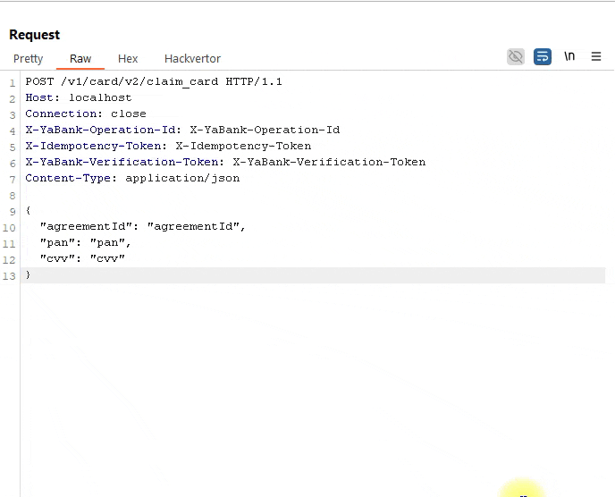

## AI Substitutor

AI Substitutor is an extension for Burp Suite that uses AI functionality to substitute values of HTTP request parameters and headers.
The extension can be used with requests from Swagger / OpenAPI, generated from JavaScript files or created with my tool [BFScan](https://github.com/BlackFan/BFScan).

### Installation

* Make sure you are using the latest version of Burp Suite Pro with AI-powered features.
* Download the JAR file with the extension from [releases page](https://github.com/BlackFan/Burp-Ai-Substitutor/releases).
* Enable the use of AI features for the extension.

### Usage

